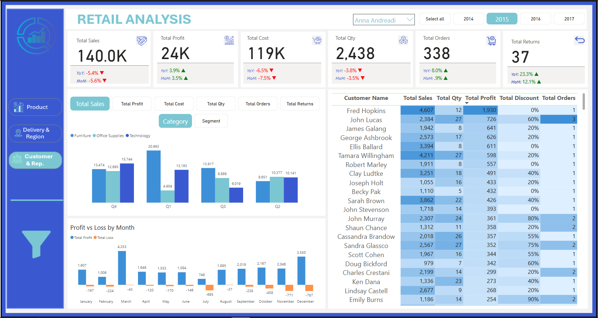

# North America Retail & Supply Chain Analytics

## 📊 Project Overview
A comprehensive Power BI dashboard analysis of a North American retail supply chain. This project dissects $2M in sales across 5,009 orders to pinpoint profitability drivers, expose loss-making segments, and evaluate logistics efficiency. The goal was to move beyond top-line sales figures and provide actionable insights for optimizing product mix, customer focus, and shipping strategies.

**🔍 Live Dashboard Preview:** *(Note: Interactive dashboard available upon request)*

## 🎯 Business Objectives
*   **Maximize Profitability:** Identify which product categories and customer segments contribute most to profit.
*   **Mitigate Losses:** Uncover the root causes of financial losses within high-performing segments.
*   **Optimize Supply Chain:** Analyze shipping modes and regional performance to improve delivery efficiency and cost.
*   **Enable Data-Driven Decisions:** Provide regional managers with clear performance metrics to guide strategy.

## 🔍 Key Insights & Impact
| Insight | Analysis | Business Impact & Recommendation |
| :--- | :--- | :--- |
| **Technology: Top Profit Driver & Primary Loss Source** | Generated the highest profit but also accounted for the most significant losses. | **Action:** Conduct a product-level audit within Technology. Promote high-margin items and renegotiate or drop consistently loss-making SKUs. |
| **Consumer Segment is Most Profitable** | Contributed **$219K in profit**, outperforming Corporate and Home Office segments. | **Action:** Tailor marketing and loyalty programs to retain and grow the Consumer customer base. Analyze what drives their purchases. |
| **Central Region is a Loss Leader** | While the **West** led in sales volume, the **Central** region reported the highest losses. | **Action:** Launch a focused review of Central region operations—pricing, promotions, and logistics costs—to stem losses. |
| **Standard Class Shipping Dominates** | The most used shipping method, but with the longest average delivery time (**42 days**). | **Action:** Evaluate if customer satisfaction is impacted by slow delivery. Test offering a discounted "Standard Plus" option to improve speed without full First-Class cost. |
| **Sales Performance Highlights** | Top Representative **Anna Andreadi** generated **$725.5K** in sales. | **Action:** Document and share best practices from top performers like Anna Andreadi to train other team members. |

## 🛠️ Technical Implementation

### Tools & Data Sources
*   **Primary Tool:** Microsoft Power BI (Data modeling, DAX, interactive visualization)
*   **Data Sources:** Relational sales database tables (Fact: Sales, Returns | Dim: Product, Customer, Region, Date, Shipping).
*   **Key Metrics Calculated:** Profit Margin, Return Rate, Average Delivery Days, Sales per Customer Segment.

### Core Analytical Approach
1.  **Data Integration & Modeling:** Connected multiple data tables in Power BI and established relationships to create a unified analysis-ready dataset.
2.  **Profitability Analysis:** Used DAX to calculate profit (`[Sales] - [Cost]`) and profit margin, slicing it by product category, customer segment, and region to identify key drivers and loss areas.
3.  **Logistics Performance:** Analyzed shipping modes (`Standard Class`, `First Class`, etc.) against delivery times and sales volume to assess efficiency trade-offs.
4.  **Interactive Dashboard Creation:** Built a multi-page report allowing users to filter by time, region, and product to explore the data dynamically.

### Sample DAX Measures
```dax
// Profit Calculation
Total Profit = CALCULATE(SUM(Fact_Order[Profit]), Fact_Order[Profit]>0)

// Profit Margin %
Profit Margin % = DIVIDE([Total Profit], SUM(Sales[Sales Amount]), 0)

// Average Delivery Days by Shipping Mode
Avg Delivery Days = AVERAGE(Fact_Order[Delivery Days])

// Orders Calculation
Total Orders = DISTINCTCOUNT(Fact_Order[Order ID])

// Goods Return Calculation
Total Returns = CALCULATE([Total Orders], Fact_Order[Return ID] = "1")

// Total Sales Calculation
Total Sales = SUM(Fact_Order[Sales])
```

## 📊 Dashboard Visuals

### 1. Sales & Profit Overview

*This dashboard shows the overall financial health: $2M sales, $443K profit, and performance across categories and customer segments. It highlights that Technology is both the top profit driver and main loss source.*

### 2. Product & Customer Analysis

*A detailed breakdown of profitability by product category and customer segment. It reveals the Consumer segment as the most profitable ($219K) and allows for granular performance analysis.*

### 3. Logistics & Regional Performance

*Analysis of shipping modes and regional performance. It identifies Standard Class as the dominant but slowest (42 days avg.) method and pinpoints the Central region as a loss leader despite the West leading in sales volume.*
